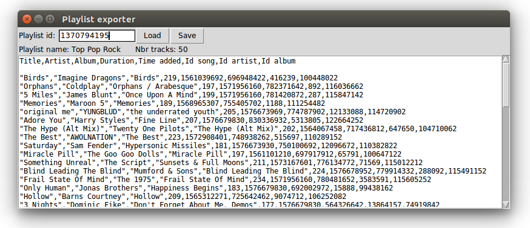

# Playlist exporter



Small script to export Deezer playlists to CSV files.

## Dependencies
The script uses `tkinter` for the GUI, and `requests` for the HTTP request.

## Usage
```
python3 -m venv env
source env/bin/activate 
pip3 install requests 
python3 exporter.py
```
